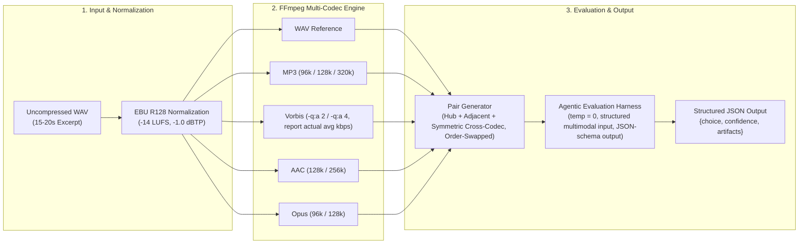

> [!NOTE]
> The objective of this project is to evaluate whether multimodal AI models exhibit monotonic, coherent perceptual representations of audio degradation when subjected to lossy compression formats. By leveraging EBU R128 loudness normalization and a [Bradley-Terry model](link-to-page.md) estimated via Maximum Likelihood (with a Bayesian fallback for small samples or separation), this framework converts binary forced-choice decisions into a latent continuous quality scale ($\beta$), explicitly controlling for presentation-order effects.

---
## 1. Research Hypotheses (Measurable)

- **$H_1$ (Monotonicity)**: $\beta_{320k} - \beta_{128k} > 1.0$ log-odds units and $\beta_{128k} - \beta_{96k} > 0.5$ log-odds units within the MP3 family. Tested one-sided against these specific non-zero thresholds (i.e. `(estimate - threshold)/SE`), not the default zero-null Wald test.
- **$H_2$ (Order Bias Magnitude)**: $|\delta| < 0.5$. Framed as an equivalence test (TOST-style): the agent is judged free of meaningful position bias if the 90% CI for $\delta$ falls entirely within $(-0.5, 0.5)$, rather than merely failing to reject $\delta = 0$.
- **$H_3$ (Cross-Codec Efficiency)**: $\beta_{\text{AAC-128k}} > \beta_{\text{MP3-128k}}$ and $\beta_{\text{Opus-96k}} > \beta_{\text{MP3-96k}}$ (modern codecs outperform legacy codecs at matched bitrates), with the same comparison also checked at Vorbis vs. MP3 (§2) so the claim isn't resting on a single codec pair per tier.

Thresholds above should be finalised from the Phase 0 pilot/power simulation, not treated as arbitrary round numbers -- record whatever values the pilot actually supports.

---
## 2. Data & Audio Processing Pipeline


> [!IMPORTANT]
> - **Clips**: &ge; 20 diverse excerpts (5 genres x 4 transient densities), to avoid complete separation and give format effects room to separate from clip-specific noise.
> - **Formats**: &ge; 10 total (WAV + 3 MP3 + 2 Vorbis + 2 AAC + 2 Opus).
> - **Pairing design**: full round-robin ($\binom{10}{2}=45$ pairs/clip), although the default standard, might be too expensive. Default design uses a **connected subset**:
>   - (a) every format vs. WAV reference -- 9 pairs, guarantees connectivity via a hub.
>   - (b) adjacent-bitrate pairs within each codec family -- 5 pairs, supports $H_1$.
>   - (c) matched-bitrate cross-codec pairs, made **symmetric across both bitrate tiers** rather than tier-128k-only: at 96k, MP3-96k vs. Vorbis-96k and MP3-96k vs. Opus-96k; at 128k, MP3-128k vs. Vorbis~128k, MP3-128k vs. AAC-128k, and MP3-128k vs. Opus-128k -- 5 pairs total, supports $H_3$ at both tiers instead of leaving 96k untested.
>   - ~19 unique pairs/clip x 2 orders x 20 clips ~ 760 presentations, plus anchors below (up from ~720 in the earlier draft -- the added 96k cross-codec pair is the cost of closing that gap). Escalate to full round-robin only if budget allows and the pilot suggests non-hub comparisons matter.
> - **Validity anchors**: per clip, one hidden-reference trial (uncompressed WAV presented as if a candidate) and one low-quality anchor (e.g. 32 kbps MP3), to confirm the agent discriminates on audio content rather than pattern-matching on duration/loudness/metadata. Excluded from the main hypothesis tests; used only as a sanity check.
> - **Power Check**: simulate Bradley-Terry data pre-collection (e.g. assumed $\beta_{96k}=-2, \beta_{128k}=-1$) to confirm this design gives >=80% power to detect the $H_1$ thresholds above.

> [!NOTE]
> On signal pre-processing parameters, take into account
> - **Loudness Target**: Integrated $-14\text{ LUFS}$ via `pyloudnorm`; cross-check with `ffmpeg`'s `loudnorm` filter.
> - **True-Peak Ceiling**: $-1.0\text{ dBTP}$.
> - **Clip Length**: 15-20 seconds -- long enough for transient/temporal artifacts to emerge, short enough to manage API cost.
> - **Vorbis note**: Vorbis is quality-targeted (VBR), not fixed-bitrate. Encode via `-q:a`, then measure and report the *resulting* average bitrate with `ffprobe` rather than treating "~96k-128k" as a literal encoder parameter.

---
## 3. Discrete Choice Econometric Framework

### 3.1 Core Specification (Bradley-Terry with Order Effects)

The Bradley-Terry model is the two-alternative special case of a conditional logit / random-utility model, which is what licenses fitting it via standard logistic regression machinery. The probability the agent prefers format $i$ over format $j$ on a given trial:

$$P(i \succ j) = \frac{1}{1 + e^{-(\beta_i - \beta_j + \delta \cdot o_{ij})}}$$

Where:
- $\beta_i$: Latent perceived quality ("worth") of format $i$, normalized so $\beta_{\text{WAV}} \equiv 0$ for identification.
- $\delta$: Order-effect coefficient ($\delta > 0$ implies a first-position advantage).
- $o_{ij} \in \{+1, -1\}$: $+1$ if $i$ was presented first on that trial, $-1$ if $j$ was presented first. Recorded per-trial (not per-pair), since every pair is shown in both orders.

This is algebraically equivalent to the symmetric-split form $P(i \succ j) = \dfrac{e^{\beta_i + \frac{1}{2}\delta o_{ij}}}{e^{\beta_i + \frac{1}{2}\delta o_{ij}} + e^{\beta_j - \frac{1}{2}\delta o_{ij}}}$ -- the two forms give identical win/loss probabilities, but the split form is the one that extends cleanly to the tie model in §3.2, so both are stated here for consistency between sections.

**Estimation**: Because $\beta_i$ only enters as a *difference* ($\beta_i - \beta_j$), the design matrix must encode each trial as (dummy columns for $i$'s format) minus (dummy columns for $j$'s format), with WAV's column omitted as reference, plus the $o_{ij}$ column. This differenced matrix is fit via `statsmodels.discrete.discrete_model.Logit` (or `statsmodels.discrete.conditional_models.ConditionalLogit` if stratifying by clip -- see Phase 3).

**Standard errors**: default to `cov_type='cluster'` with `cov_kwds={'groups': clip_id}`, since multiple comparisons share the same underlying clip. However, with only 20 clips (clusters), this sits near or below the G~30-50 range where cluster-robust SE asymptotics are typically considered reliable -- the exact threshold is debated in the literature, but 20 is low enough to be cautious. As a robustness check, re-estimate inference via **wild cluster bootstrap** (Cameron, Gelbach & Miller 2008), clustering on `clip_id`. `statsmodels` doesn't implement CGM wild bootstrap natively -- use the `wildboottest` package, or a hand-rolled bootstrap-t loop, rather than assuming a `cov_type` flag covers this. Treat this as a check on the cluster-robust SEs, not a replacement for the `ConditionalLogit` clip-stratified fit in Phase 3, which addresses clip heterogeneity in the point estimates rather than the inference.

### 3.2 Handling Ties and Indifference

Agents may respond "equivalent" or with low confidence. Use the **Davidson (1970)** extension of Bradley-Terry, with the order term carried through into the item-strength exponentials (not dropped, as in an earlier draft of this document) so that order bias is controlled consistently whether the agent expresses a preference or calls a tie:

$$P(i \succ j) = \frac{e^{\beta_i + \frac{1}{2}\delta o_{ij}}}{e^{\beta_i + \frac{1}{2}\delta o_{ij}} + e^{\beta_j - \frac{1}{2}\delta o_{ij}} + \nu\sqrt{e^{\beta_i + \beta_j}}}, \qquad P(\text{tie}) = \frac{\nu\sqrt{e^{\beta_i + \beta_j}}}{e^{\beta_i + \frac{1}{2}\delta o_{ij}} + e^{\beta_j - \frac{1}{2}\delta o_{ij}} + \nu\sqrt{e^{\beta_i + \beta_j}}}$$

Note the $\nu\sqrt{e^{\beta_i+\beta_j}}$ term is itself order-invariant (the $\pm\frac12\delta o_{ij}$ terms cancel in the sum $\beta_i+\beta_j$), so only the win/loss terms need the order adjustment -- the tie probability doesn't depend on presentation order, which is the intuitively correct behavior.

$\nu \geq 0$ is estimated jointly with $\{\beta_i\}$ and $\delta$ via maximum likelihood; $\nu \to 0$ recovers standard BT. If too few ties occur for stable estimation of $\nu$, fall back to coding ties as 0.5-wins-each (an approximation, not the preferred solution).

The `confidence` field collected in the JSON output can be used here -- e.g. as an inverse-variance case weight in the likelihood, or to set a data-driven confidence threshold below which a "win" is recoded as a tie for robustness checks. If it ends up unused, drop it from the schema rather than let it sit uninterpreted.

### 3.3 Separation & Identification Diagnostics

Before interpreting any coefficients, check:
1. **Complete/quasi-complete separation**: any format that wins 100% (or loses 100%) of its comparisons pushes its MLE estimate toward $\pm\infty$. Detect via `statsmodels`' separation warnings.
2. **Connectivity**: the comparison graph (formats as nodes, observed comparisons as edges) must be fully connected for all $\beta_i$ to be jointly identified -- independent of sample size. The hub-and-spoke design in §2 guarantees this by construction, but verify it wasn't broken by dropped/failed trials before fitting.

**If separation occurs**: prefer a fully Bayesian fit (`pymc`, weakly informative `Normal(0, 2)` priors on $\beta$) or genuine Firth bias-reduction via the `firthlogit` package (Firth's method is a specific Jeffreys-prior penalized likelihood, not the same as generic L1/L2 shrinkage via `fit_regularized` -- don't conflate the two).

---
## 4. Execution Roadmap

- [ ] **Phase 0: Power Analysis & Pilot**
    - [ ] Simulate Bradley-Terry data under assumed effect sizes to confirm the §2 design (20 clips, hub+adjacent+symmetric cross-codec pairing) gives >=80% power for the $H_1$ thresholds.
    - [ ] Run a pilot on 2 clips through the full pipeline (normalization -> encoding -> pairing -> structured-audio agent call -> parsing) to validate the harness end-to-end before scaling up.
- [ ] **Phase 1: Environment & Signal Prep**
    - [ ] Initialize environment: `pyloudnorm`, `soundfile`, `ffmpeg-python`, `pandas`, `statsmodels`, `pingouin`, `wildboottest`.
    - [ ] Curate 20 WAV excerpts spanning transient-heavy (castanets), sustained-tone (harpsichord), speech, full-mix pop, and orchestral material.
    - [ ] Batch process: normalize -> encode all 10 formats -> verify actual bitrates with `ffprobe` (especially for Vorbis).
- [ ] **Phase 2: Agent Harness & Data Collection**
    - [ ] Build the pair generator per the §2 hub + adjacent + symmetric cross-codec design; verify the resulting graph is connected before proceeding.
    - [ ] Present every pair in both orders (full counterbalancing), not a single randomized order -- this is what makes $\delta$ identifiable at all.
    - [ ] Include hidden-reference and low-quality anchor trials per clip.
    - [ ] **LLM Configuration**: `temperature=0`, fixed seed where available. At `temp=0`, identical (clip, order) inputs return identical outputs, so this design measures *deterministic* preferences, not response variance. "Repetition" here means **order-swapped re-presentation of the same pair**, used for a self-consistency check (reversal rate, transitivity across triads) in Phase 3 -- not an ICC-style reliability estimate, which requires genuine sampling variance and doesn't apply here.
    - [ ] **(Optional, exploratory)**: a secondary arm at `temperature > 0`, unfixed seed, with N repeats per pair, if a true stochastic-reliability estimate is separately wanted -- treat as a distinct sub-study with its own ICC analysis, not mixed into the main deterministic design.
    - [ ] **Audio delivery**: pass each clip as a structured multimodal content part, not as a base64 string interpolated into the text prompt -- an inline `f"Sample A: [base64_A]"` gets tokenized as text by audio-capable APIs rather than decoded as audio. Schematic below (exact field names vary by provider -- confirm against whichever of `openai`/`litellm` is used).
```python
messages = [
    {"role": "system", "content": system},
    {"role": "user", "content": [
        {"type": "text", "text": "Sample A:"},
        {"type": "input_audio", "input_audio": {"data": base64_A, "format": "wav"}},
        {"type": "text", "text": "Sample B:"},
        {"type": "input_audio", "input_audio": {"data": base64_B, "format": "wav"}},
        {"type": "text", "text": "Which has higher audio quality?"}
    ]}
]
```
- [ ] **Prompt/output schema**: enforced via the API's structured-output/JSON-schema mode, not free-text parsing.

```python
system = (
    "You are an audio quality evaluator. Compare two audio samples and "
    "determine which has higher fidelity/clarity. Use technical audio "
    "terminology where relevant."
)
response_schema = {
    "type": "object",
    "properties": {
        "choice": {"type": "string", "enum": ["A", "B", "tie"]},
        "confidence": {"type": "integer", "minimum": 1, "maximum": 5},
        "artifacts": {"type": "array", "items": {"type": "string"}}
    },
    "required": ["choice", "confidence"]
}
```
- [ ] Handle edge cases: API refusals, schema-validation failures, explicit "tie" responses (feed into §3.2).
- [ ] **Phase 3: Econometric Modeling**
    - [ ] Construct the differenced design matrix described in §3.1 (per-trial format-dummy differences + order indicator), WAV omitted as reference.
    - [ ] Fit Model 1: pooled Bradley-Terry-with-order-effects via `Logit`, `cov_type='cluster'` clustered on `clip_id`; cross-check inference via wild cluster bootstrap given only 20 clusters.
    - [ ] Fit Model 2 (robustness): `ConditionalLogit` stratified by clip, to absorb clip-level heterogeneity directly in the point estimates.
    - [ ] Run separation and connectivity diagnostics (§3.3) before interpreting either model.
    - [ ] Test $H_1$ via one-sided tests against the non-zero thresholds; test $H_2$ via the TOST-style equivalence check; test $H_3$ at both the 96k and 128k tiers now that both are in the design.
    - [ ] Compute order-swap self-consistency metrics: preference-reversal rate, and transitivity-violation rate across comparison triads.
    - [ ] If a stability check across estimation subsets is wanted, frame it as a **subset-stability / transitivity diagnostic** (re-fit on data subsets, check $\beta_i - \beta_j$ stability) -- not a classical Hausman IIA test, which assumes >=3 simultaneously available alternatives per choice occasion and doesn't map cleanly onto a purely pairwise design.
- [ ] **Phase 4: Validation & Visualization**
    - [ ] Plot $\beta$ estimates with 95% CIs (caterpillar plot); flag overlapping CIs between adjacent bitrates.
    - [ ] If monotonicity fails: extract [[Mel-Spectrogram]] via `librosa` for the anomalous pairs and inspect for spectral rolloff or pre-echo.
    - [ ] Likelihood-ratio test comparing the model with vs. without the order effect $\delta$.

---
## 5. Technical Stack

| Category | Tool / Library | Notes |
| :--- | :--- | :--- |
| Audio Normalization | `pyloudnorm`, `soundfile` | Cross-check integrated loudness against `ffmpeg`'s `loudnorm` filter. |
| Encoding Engine | `ffmpeg-python` | CBR (`-b:a`) for MP3/AAC/Opus; `-q:a` for Vorbis with measured resulting bitrate via `ffprobe`. |
| LLM Interface | `openai` SDK for OpenAI audio-capable models; `litellm` if cross-provider comparison (e.g. Gemini) is in scope. | Structured multimodal content parts for audio input (not inline base64 text); JSON-schema structured-output mode for the response. |
| Econometric Fitting | `statsmodels` (`Logit` for pooled model, `ConditionalLogit` for clip-stratified robustness); `pymc` if Bayesian fallback needed for separation; `wildboottest` for small-cluster inference. | Differenced design matrix per §3.1; `cov_type='cluster'` on `clip_id`, cross-checked with wild cluster bootstrap given G=20. |
| Reliability Metrics | `pingouin` | Order-swap reversal/transitivity rates as primary consistency metric; ICC only if a genuine stochastic-resampling arm (temp > 0) is added. |
| Visualizations | `matplotlib`, `seaborn` | Caterpillar plots for $\beta$ parameters. |

---
## 6. Risk Mitigation & Alternative Specifications

| Risk                                                   | Mitigation                                                                                                                                                                            |
| ------------------------------------------------------ | ------------------------------------------------------------------------------------------------------------------------------------------------------------------------------------- |
| **Complete/quasi-complete separation**                 | Bayesian estimation with weakly informative priors (`pymc`), or genuine Firth bias-reduction (`firthlogit`) -- not generic `fit_regularized` shrinkage.                                |
| **Non-identification / disconnected comparison graph** | Design guarantees connectivity via the WAV hub (§2); re-verify after any dropped/failed trials before fitting.                                                                        |
| **Small-cluster bias in SEs (G=20)**                   | Cross-check `cov_type='cluster'` inference with wild cluster bootstrap (`wildboottest`); treat as complementary to, not a substitute for, the clip-stratified `ConditionalLogit` fit. |
| **Audio misdelivered as text tokens**                  | Pass audio as structured multimodal content parts (e.g. `input_audio`), never as base64 interpolated into a text string.                                                              |
| **Asymmetric cross-codec coverage**                    | Cross-codec pairs now symmetric across both the 96k and 128k tiers (§2), so $H_3$ isn't resting on a single bitrate.                                                                  |
| **API Cost/Rate Limits**                               | Hub+adjacent+symmetric-cross-codec design (§2) cuts presentations from ~1,800 (full round-robin) to ~760+anchors; cache results; pilot on 2 clips first.                              |
| **Non-monotonic $\beta$**                              | Post-hoc: cluster clips by spectral centroid/transient density; test whether monotonicity holds only for specific content types.                                                      |
| **Order effect confounds quality**                     | Full order-counterbalancing (§2, §4), with the order term now consistently present in both the win/loss and tie formulas (§3.1-3.2).                                                  |
| **Deterministic-output "reliability" confusion**       | Self-consistency (order-swap, temp=0, primary) kept explicitly separate from stochastic reliability (resampling, temp>0, optional secondary arm).                                     |

---
> [!tip]
> If results show coherent perceptual scaling, review suitability for **ICASSP** or **ISMIR** (audio ML venues) or behavioural/experimental economics journals (JEBO, *Experimental Economics*) submission. Entirely frame-dependant; novelty introduced by applying classical psychophysical paired-comparison methods (2AFC / Bradley-Terry) to LLM evaluation/ABMs rather than human subjects.
